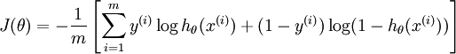

## Logistics回归和SVM比较

1. 相同点
2. 不同点
3. 如何选择

### 1. 相同点

#### 1.1 LR和SVM都是分类算法

认为判断一个算法是分类还是回归算法的唯一标准就是样本label的类型，如果label是离散的，就是分类算法，如果label是连续的，就是回归算法。很明显，LR的训练数据的label是“0或者1” ，当然是分类算法。

#### 1.2 如果不考虑核函数，LR和SVM都是线性分类算法，也就是说他们的分类决策面都是线性的

其实LR也是可以用核函数的，至于为什么通常在SVM中运用核函数而不在LR中运用，在计算决策面时，SVM算法里只有少数几个代表支持向量的样本参与了计算，也就是只有少数几个样本需要参与核计算（即kernal machine解的系数是稀疏的）。然而，LR算法里，每个样本点都必须参与决策面的计算过程，也就是说，假设我们在LR里也运用核函数的原理，那么每个样本点都必须参与核计算，这带来的计算复杂度是相当高的。 总之，原始的LR和SVM都是线性分类器，

#### 1.3 LR和SVM都是监督学习算法

#### 1.4 LR和SVM都是判别模型

判别模型会生成一个表示$$P(Y|X)$$的判别函数（或预测模型），而生成模型对$$P(X|Y)$$建模，即在给定所属类的情况下，显示某种特征的概率，同时对P(Y)建模，由此计算联合概率$$P(X, Y)$$,$$P(X,Y)=P(X|Y)*P(Y)$$,然后通过贝叶斯公式转化为条件概率。简单来说，在计算判别模型时，不会计算联合概率，而在计算生成模型时，必须先计算联合概率。或者这样理解：生成算法尝试去找到底这个数据是怎么生成的（产生的），然后再对一个信号进行分类。基于你的生成假设，那么哪个类别最有可能产生这个信号，这个信号就属于那个类别。判别模型不关心数据是怎么生成的，它只关心信号之间的差别，然后用差别来简单对给定的一个信号进行分类。常见的判别模型有：KNN、SVM、LR，常见的生成模型有：朴素贝叶斯，隐马尔可夫模型。

 ### 2. 不同点

#### 2.1 loss function 不同：

逻辑回归的损失函数：

SVM的损失函数：

$$L(w,b,\alpha ) = \frac{1}{2}{\left\| w \right\|^2} + \sum\limits_{i = 1}^n {{\alpha _i}({y_i}({w^T}{x_i} + b) - 1)} $$

#### 2.2 支持向量机只考虑局部的边界线附近的点，而逻辑回归考虑全局（远离的点对边界线的确定也起作用）

线性SVM不直接依赖于数据分布，分类平面不受一类点影响；LR则受所有数据点的影响，如果数据不同类别strongly unbalance，一般需要先对数据做balancing。（这里还不理解。---------------------------------）

#### 2.3 在解决非线性问题时，支持向量机采用核函数的机制，而LR通常不采用核函数的方法。

分类模型的结果就是计算决策面，模型训练的过程就是决策面的计算过程。通过上面的第二点不同点可以了解，在计算决策面时，SVM算法里只有少数几个代表支持向量的样本参与了计算，也就是只有少数几个样本需要参与核计算（即kernal machine解的系数是稀疏的）。然而，LR算法里，每个样本点都必须参与决策面的计算过程，也就是说，假设我们在LR里也运用核函数的原理，那么每个样本点都必须参与核计算，这带来的计算复杂度是相当高的。所以，在具体应用时，LR很少运用核函数机制。 

#### 2.4 线性SVM依赖数据表达的距离测度，所以需要对数据先做normalization，LR不受其影响。

#### 2.5 SVM的损失函数就自带正则

SVM叫做结构风险最小化算法，所谓结构风险最小化，意思就是在训练误差和模型复杂度之间寻求平衡，防止过拟合，从而达到真实误差的最小化。未达到结构风险最小化的目的，最常用的方法就是添加正则项 。

### 3.如何选择 

n是feature的数量   m是样本数
1、如果n相对于m来说很大，则使用LR算法或者不带核函数的SVM（线性分类）
n远大于m，n=10000，m=10-1000
2、如果n很小，m的数量适中（n=1-1000，m=10-10000）
使用带有核函数的SVM算法
3、如果n很小，m很大（n=1-1000，m=50000+）
增加更多的feature然后使用LR算法或者不带核函数的SVM
LR和不带核函数的SVM比较类似。