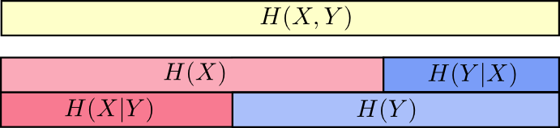

## 信息量，信息熵，交叉熵，KL散度和互信息

参考链接：https://blog.csdn.net/haolexiao/article/details/70142571

https://www.zhihu.com/question/41252833

### 1. 信息量

信息量指消息中未知程度的大小，未知程度大，信息量就大。所以p(x)越大，信息量越小。

**信息量可以用编码一个信息所需要的编码长度来衡量**，而一个信息的编码长度跟其出现的概率是呈负相关的，因为一个短编码的代价也是巨大的，一个短编码会放弃所有以其为前缀的编码方式，比如字母“a"如果用单一的一个0来表示的话，那么为了避免歧义，就不能用其他任何以0开头的编码词了，所以**一个词出现的越频繁，则其编码方式也就越短，同时付出的代价也越大。**

$$I = log_2(\frac{1}{p(x)}) = -log_2(p(x))  \tag1$$

### 2. 信息熵

信息熵则代表一个分布的信息量,或者编码的平均长度  

$$H(p) = \sum_x p(x)\log_2\left(\frac{1}{p(x)}\right) = -\sum_x p(x)\log_2\left(p(x)\right)  \tag2$$

即熵的本质是香农信息量$$log_2(\frac{1}{p(x)})$$的期望。

### 3. 交叉熵

本质：**用预测分布q来表示真实分布p的平均编码长度。**（即用预测分布的编码方式去编码其真实的分布,得到的平均编码长度或者信息量）  

$$H_q(p) = \sum_xp(x)\log_2\left(\frac{1}{q(x)}\right) \tag3$$

其中$$H_q(p)$$也可写为：$$H(p,q)$$，因为用q来编码的样本来自分布p，所以期望$$H(p,q)$$中概率是$$p(i)$$。 

##### 为什么要用交叉熵损失呢？

它本质上相当于衡量两个编码方式之间的差值，因为只有当猜测的分布约接近于真实分布，则其值越小。  

$$L = -\sum_iy_ilog(p(x_i))+(1-y_i)log(1-p(x_i))  \tag4$$

##### 在LR中用交叉熵损失而不用平方误差原因

1. 在LR中，如果用平方损失函数，则损失函数是一个非凸的，而用cross-entropy的话就是一个凸函数

2. 用cross-entropy做LR求导的话，得到的导数公式如下  

   $$\frac{\partial L}{\partial \theta_j} = -\sum_i(y_i-p(x_i))x_{ij} $$

   而用平方损失函数的话，其求导结果为 ：

   $$\frac{\partial L}{\partial \theta_j} = -\sum_i(y_i-p(x_i))p'(x_i) $$

   平方损失函数中会出现$$p′(x_i)$$，而使用sigmoid函数的导数会出现梯度消失的问题。

### 4. KL散度

KL散度/距离是衡量两个分布的距离,KL距离一般用$$D(p||q)$$或者$$D_q(p)$$称之为q对p的相对熵 

非真实分布q得到的平均编码长度H(p,q)大于根据真实分布p得到的平均编码长度H(p)。事实上，根据[Gibbs' inequality](https://link.zhihu.com/?target=https%3A//en.wikipedia.org/wiki/Gibbs%2527_inequality)可知，H(p,q)>=H(p)恒成立，当q为真实分布p时取等号。我们将由q得到的平均编码长度比由p得到的平均编码长度多出的bit数称为“相对熵”：

 $$D_q(p) = H_q(p) - H(p) = \sum_x p(x)\log_2\left(\frac{p(x)}{q(x)}\right)  \tag5$$

##### KL散度与交叉熵的关系图像表示

$$H(p)$$代表分布p所含信息量，或者说是编码分布p的平均编码长度。

 第二行是cross-entropy，即用q来编码p所含的信息量/平均编码长度|或者称之为q对p的cross-entropy  

第三行是上面两者之间的差值即为q对p的KL距离 

#####   KL散度的非负性证明

 $$D_q(p)=∑_xp(x)log_2(\frac{p(x)}{q(x)}) $$

$$=−∑_xp(x)log_2(\frac{q(x)}{p(x)})$$

$$=−E(log_2(\frac{q(x)}{p(x)}))$$

$$≥log_2E(\frac{q(x)}{p(x)})$$

$$=log_2∑_xp(x)(\frac{q(x)}{p(x)})$$

$$=log2∑_xq(x)$$

 因为：$$\sum_x q(x) = 1 $$

所以上式：$$D_q(p) \ge 0 $$

### 5. 联合信息熵

联合信息熵：

$$H(X,Y) = \sum_{x,y} p(x,y) \log_2\left(\frac{1}{p(x,y)}\right) $$

条件信息熵：  

$$ H(X|Y) = \sum_y p(y) \sum_x p(x|y) \log_2\left(\frac{1}{p(x|y)}\right) $$

$$= \sum_{x,y} p(x,y) \log_2\left(\frac{1}{p(x|y)}\right) $$

**图示：** 

所以当已知$$H(x)$$这个信息量的时候，联合分布$$H(X,Y)$$剩余的信息量就是**条件熵**：

$$H(Y|X) = H(X,Y) - H(X) $$

### 6. 互信息（信息增益）

互信息就是一个联合分布中的两个信息的纠缠程度/或者叫相互影响那部分的信息量  

$$I(X,Y) = H(X) + H(Y) - H(X,Y)$$

$$I(X,Y) = H(Y) - H(Y|X)$$

上面第二个式子可以理解为：X的发生与否，对于Y的影响。

**决策树中的信息增益就是互信息**，决策树是采用的上面第二种计算方法，即把分类的不同结果看成不同随机事件Y，然后把当前选择的特征看成X，则信息增益就是当前Y的信息熵减去已知X情况下的信息熵。 

图示：

以上图可以清楚的看到互信息I(X,Y)I(X,Y)的不同求法 
这里还有另外一个量叫variation of information

$$V(X,Y)=H(X,Y)−I(X,Y)$$

Variation of information度量了不同随机变量之间的差别，如果$$V(X,Y)=0$$

说明这两个变量是完全一致的，其约大说明两个变量越独立。 

这里再注意一下Variation of information和KL距离的差别： 

Variation of information是联合分布中（即同一个分布中）的两个变量相互影响的关系 

KL和cross-entropy是两个不同分布之间的距离度量