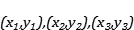
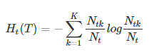
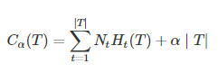

## 决策树

决策树是基于树结构来进行决策的，一棵决策树包含一个根节点，若干个内部结点，若干个叶结点。叶结点对应于决策结果，即所属类；内部结点表示一个属性测试，每一个分支代表一个属性输出，根结点包含样本全集。

---

1. 算法流程
2. 信息熵、信息增益、信息增益率
3. 基尼指数
4. 剪枝处理
5. 目标值连续处理（即决策树用于递归）
6. 决策树的损失函数

---

**实质理解**：

决策树是分段线性函数，它具有非线性建模的能力。只要划分的足够细， 分段常数函数可以逼近闭区间上任意函数到任意指定精度，因此决策树在理论上可以对任意复杂度的数据进行分类或者回归。

### 1.算法流程：

### 2. 信息熵、信息增益、信息增益率

“信息熵”（information entropy）是度量样本集和纯度最常用的一种指标。假定当前样本集合$$D$$中第$$k$$类样本所占的比例为$${p_k}(k = 1,2,...,|{\cal Y}|)$$则$$D$$的信息熵定义为：

$$Ent(D)$$的值越小，$$D$$的纯度越高。

**Notice:**

**信息增益：**

**信息增益率：**

需要注意的是，增益率准则对可取值数目较少的属性有所偏好，因此C4.5算法并不是直接选择增益率最大的候选划分属性，而是使用：先从候选划分属性中找到信息增益高于平均水平的属性，再从中选择增益率最高的。

### 3. 基尼指数

### 4.剪枝处理 

剪枝(pruning)是决策树学习算法对付"过拟合"的主要手段.在决策树学习中，为了尽可能正确分类训练样本，结点划分过程将不断重复，有时会造成决策树分支过多，这时就可能因训练样本学得"太好"了，以致于把训练集自身的一些特点当作所有数据都具有的一般性质而导致过拟合.因此，可通过主动去掉一些分支来降低过拟合的风险。一般分为“预剪枝”和“后剪枝”。

#### 4.1 预剪枝

剪枝是指在决策树生成过程中，对每个结点在划分前先进行估计，若当前结点的划分不能带来决策树泛化性能提升，则停止划分并将当前结点标记为叶结点; 

#### 4.2 后剪枝

后剪枝则是先从训练集生成一棵完整的决策树，然后自底向上地对非叶结点进行考察，若将该结点对应的子树替换为叶结点能带来决策树泛化性能提升，则将该子树替换为叶结点. 

### 5. 目标值连续处理

决策树能不能用于回归？ 因为对于回归问题而言，不仅属性值变得连续，就连target也会变得连续，而我们即便用所谓的二分法处理了属性值连续的问题，连续的target仍然会导致我们的信息熵无法计算。

决策树回归用了一种将连续的空间离散化的思路，就好像我们为了计算积分，要把函数下面的区域来分成一个个的小方格，最后用求极限来得出最后的积分。回归决策树则是利用递归的思路，将连续空间分为几个部分，target和属性作为一个整体被切分，然后我们在切分的区域上利用损失函数来计算损失，与上一个问题类似，信息熵定义在不同的划分点上，损失也会定义在不同的划分点上，我们就遵循着损失最小化的原则去寻找最小的划分点。

我们来考虑最简单的单变量回归数据，我们的样本只有一个特征：x，和一个target：y。n个样本的集合就可以被表示为......，我们采用二分法的话，划分点就有n-1种。对于其中的可能划分点b，会把我们的特征和target所组成的数据同时划分为D1、D2，我们在此基础上定义损失：

是样本的target值，是D1所包含的样本target的平均值。整个损失，其实就是切分后各个样本集合损失之和，因为每个划分点所形成的划分区域不同，所以我们要都每一个划分点做如上的计算，挑出损失最小对应划分点。

完成上述步骤之后，我们也只进行了一次划分，如果直接利用结果，决策树的能够预测的值只有两个，因为只有两块区域，所以我们需要继续对每块区域继续进行划分，这就是递归的思路，直到决策树有着合适的深度，其实也对应着我们的区域划分次数，我们就可以将这样的模型作为我们最终的模型。

### 6. 决策树的损失函数

为了避免出现过拟合的现象，我们要对决策树进行剪枝。

设决策树的子节点集合为T，t是T中的一个元素，该叶节点有$$N_t$$个样本，其中k类的样本有$$N_{tk}$$个，共K个分类:

 

则损失函数可以定义为：

解释：

右边第一项表示误差大小，第二项表示模型的复杂度，也就是用叶节点表示，防止过拟合。

1. $$H_t(T)$$代表什么？代表信息熵，展示了这个结点的纯度，$$H_t(T)$$的值越小，则这个结点里面的样本纯度越高，前面乘以这个结点包含的样本数，相当于对于每一个结点，计算出它的不确定度，然后乘以一个权重（即它所包含的样本数）
2. 如果单纯的将第一项作为loss，那么将会很容易产生过拟合，因为只要保证节点数量越多结果就会越好。（每个样本一个结点，熵自然最小），所以为了防止过拟合发生，需要考虑正则化，其中$$\alpha$$是权值系数，用来权衡两者的影响，较大的$$\alpha$$促使选择简单的模型。

