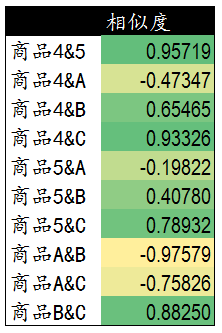

## 协同过滤

1. 定义
2. 基于用户的协同过滤算法
3. 基于物品的协同过滤算法

### 1. 定义

协同过滤是著名的推荐算法。主要的功能是预测和推荐。算法通过对用户历史行为数据的挖掘发现用户的偏好，基于不同的偏好对用户进行群组划分并推荐品味相似的商品。协同过滤推荐算法分为两类，分别是基于用户的协同过滤算法（user-based collaboratIve filtering），和基于物品的协同过滤算法（item-based collaborative filtering）。

### 2.基于用户的协同过滤算法 

基于用户的协同过滤算法是通过用户的历史行为数据发现用户对商品或内容的喜欢（如商品购买，收藏，内容评论或分享），并对这些喜好进行度量和打分。根据不同用户对相同商品或内容的态度和偏好程度计算用户之间的关系。在有相同喜好的用户间进行商品推荐。简单的说就是如果A,B两个用户都购买了x,y,z三本图书，并且给出了5星的好评。那么A和B就属于同一类用户。可以将A看过的图书w也推荐给用户B。  

简单来说：

1. 查找购买相同物品的用户
2. 查看它们的评分是否都是很高，如果是，则将他们归为一类
3. 对同一类的用户相互推荐他们购买的相异的物品，即A和B属于同一类用户。可以将A看过的图书w也推荐给用户B。  

详细步骤：

#### 2.1 寻找偏好相似的用户

模拟了5个用户对两件商品的评分，来说明如何通过用户对不同商品的态度和偏好寻找相似的用户。在示例中，5个用户分别对两件商品进行了评分。这里的分值可能表示真实的购买，也可以是用户对商品不同行为的量化指标。例如，浏览商品的次数，向朋友推荐商品，收藏，分享，或评论等等。这些行为都可以表示用户对商品的态度和偏好程度。 

从表格中很难直观发现5个用户间的联系，我们将5个用户对两件商品的评分用散点图表示出来后，用户间的关系就很容易发现了。在散点图中，Y轴是商品1的评分，X轴是商品2的评分，通过用户的分布情况可以发现，A,C,D三个用户距离较近。用户A(3.3 6.5)和用户C(3.6 6.3)，用户D(3.4 5.8)对两件商品的评分较为接近。而用户E和用户B则形成了另一个群体。  散点图虽然直观，但无法投入实际的应用，也不能准确的度量用户间的关系。因此我们需要通过数字对用户的关系进行准确的度量，并依据这些关系完成商品的推荐。 

##### 2.1.1 欧几里得距离评价

假设用户x,y分别对n件物品都有评价，那么可以用下式作为距离评价公式：

公式解释：

$$x,y$$ 表示两个用户

$$x_i$$表示用户$$x$$对商品$$i$$的评价

$$n$$表示共有多少件商品

通过公式我们获得了5个用户相互间的欧几里德系数，也就是用户间的距离。系数越小表示两个用户间的距离越近，偏好也越是接近。不过这里有个问题，太小的数值可能无法准确的表现出不同用户间距离的差异，因此我们对求得的系数取倒数，使用户间的距离约接近，数值越大。在下面的表格中，可以发现，用户A&C用户A&D和用户C&D距离较近。同时用户B&E的距离也较为接近。与我们前面在散点图中看到的情况一致。  

##### 2.1.2 皮尔逊相关度评价

皮尔逊相关度评价是另一种计算用户间关系的方法。他比欧几里德距离评价的计算要复杂一些，但对于评分数据不规范时皮尔逊相关度评价能够给出更好的结果。以下是一个多用户对多个商品进行评分的示例。这个示例比之前的两个商品的情况要复杂一些，但也更接近真实的情况。我们通过皮尔逊相关度评价对用户进行分组，并推荐商品。  

公式如下：结果是一个在-1与1之间的系数。该系数用来说明两个用户间联系的强弱程度。  

公式解释：

X表示用户x对n件物品评价所成的列向量

Y表示用户y对n件物品评价所成的列向量

相关系数的分类

- 0.8-1.0 极强相关
- 0.6-0.8 强相关
- 0.4-0.6 中等程度相关
- 0.2-0.4 弱相关
- 0.0-0.2 极弱相关或无相关

通过计算5个用户对5件商品的评分我们获得了用户间的相似度数据。这里可以看到用户A&B，C&D，C&E和D&E之间相似度较高。下一步，我们可以依照相似度对用户进行商品推荐。

#### 2.2 为相似的用户提供推荐物品

假设为用户C推荐商品，检查上面计算出的相似度列表，发现用户C和用户D和E的相似度较高。所以可以将D和E购买过的，C没有购买过的商品推荐给C：

将这些物品加权排序推荐：

我们提取了用户D和用户E评价过的另外5件商品A—商品F的商品。

1. 将D对商品A-商品F的评价乘以它与用户C的相似度，得到新的物品评价，E也是如此
2. 将D和E对同一件物品的评价求和，得到评价总计
3. 将用户D和用户E对用户C的相似度求和，得到相似度总计
4. 将评价总计除以相似度总计，得到最终的排序数据。由高到低进行排序，得到最终结果

以上是基于用户的协同过滤算法。这个算法依靠用户的历史行为数据来计算相关度。也就是说必须要有一定的数据积累（冷启动问题）。对于新网站或数据量较少的网站，还有一种方法是基于物品的协同过滤算法。

### 3. 基于物品的协同过滤算法

通过计算不同用户对不同物品的评分获得物品间的关系。基于物品间的关系对用户进行相似物品的推荐。 简单来说就是如果用户A同时购买了商品1和商品2，那么说明商品1和商品2的相关度较高。当用户B也购买了商品1时，可以推断他也有购买商品2的需求。 

图片解释：

用户1 买过P1，P3，P4

用户2 买过P1，P3

用户3 买过P2，P3，那么就可以向用户3推荐 P1

#### 3.1 寻找相似物品

表格中是两个用户对5件商品的评分。在这个表格中我们用户和商品的位置进行了互换，通过两个用户的评分来获得5件商品之间的相似度情况。单从表格中我们依然很难发现其中的联系，因此我们选择通过散点图进行展示。  

在散点图中，X轴和Y轴分别是两个用户的评分。5件商品按照所获的评分值分布在散点图中。我们可以发现，商品1,3,4在用户A和B中有着近似的评分，说明这三件商品的相关度较高。而商品5和2则在另一个群体中。

##### 3.1.1 欧几里德距离评价

对于商品x，y有：

公式解释：

x，y表示两件商品

$$x_i$$表示第$$i$$个用户对商品$$x$$的评价

$$y_i$$表示第$$i$$个用户对商品$$y$$的评价

$$n$$表示共有多少个用户

通过欧几里德系数可以发现，商品间的距离和关系与前面散点图中的表现一致，商品1,3,4距离较近关系密切。商品2和商品5距离较近。

##### 3.1.2 皮尔逊相关度评价

我们选择使用皮尔逊相关度评价来计算多用户与多商品的关系计算。下面是5个用户对5件商品的评分表。我们通过这些评分计算出商品间的相关度。 

皮尔逊相关度计算公式：

公式解释：

X表示n个用户对商品x的评价组成的列向量

y表示n个用户对商品y的评价组成的列向量

通过计算可以发现，商品1&2，商品3&4，商品3&5和商品4&5相似度较高。下一步我们可以依据这些商品间的相关度对用户进行商品推荐。  

##### 3.2 为用户提供相似物品的推荐

当需要对用户C基于商品3推荐商品时，需要计算新的商品与已有商品间的相似度列表。在前面的相似度计算中，商品3与商品4和商品5相似度较高，因此我们可以计算并获得商品4,5与其他商品的相似度列表。 

通过皮尔逊公式，计算新商品与已有商品的相似度数据：

**加权排序推荐**

这里是用户C已经购买过的商品4,5与新商品A,B,C直接的相似程度。

1. 将用户C对已购买商品4的评价*商品4与商品A的相关度，得到新的相关度数值
2. 将通过商品4和商品5计算出来的关于商品A的新的相关度数值进行相加
3. 计算用户C对商品4和商品5的评分和
4. 将新的相关度数值的和除以评分和，得到最后可以排序的数值，按照从大到小进行排序，进行推荐

参考链接：欢迎转载，但请注明转自“[蓝鲸网站分析博客](http://bluewhale.cc/)”。  Read more: <http://bluewhale.cc/2016-03-11/collaborative-filtering.html#ixzz5P0x9RRCh> 