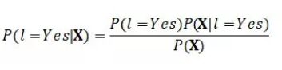

## 基于贝叶斯推断的分类模型

1. 数学准备

### 1. 数学准备

* 概率：事件不确定性程度的量化，概率越大，表示事件发生的可能性越大。
* 条件概率：P(A|B)，在条件B下，发生A的概率。
* 联合概率：P(A,B)，A事件与B事件同时发生的概率。如果因子相互独立，联合概率等于因子概率乘积，即P(A,B)=P(A)P(B)。如果因子独立性不可知，那么有更普遍的形式：P(A,B)=P(B)P(A|B)。
* 边缘概率：$$\sum{AP(A,B)}$$或$$\smallint AP(A,B)$$ ，对联合分布其中一个因子的求和（积分），就得到了另一个因子的边缘概率。
* 独立同分布：随机变量中每个变量的概率分布相同，且变量之间互相独立。

边缘概率解释：

边缘概率的分布情况，就叫边缘分布。和“边缘”两个字本身没太大关系，因为是求和，在表格中往往将这种值放在margin（表头）的位置，所以叫margin distribution。 

假定两个变量的联合概率分布为：$$P(x,y)$$

我们知道了一组变量的联合概率分布，但想要了解其中一个子集的概率分布。这种定义在子集上的概率分布被称为**边缘概率分布**：

定义：其中一个特定变量的边缘分布则为给定其他变量的[条件概率](https://zh.wikipedia.org/wiki/%E6%9D%A1%E4%BB%B6%E6%A6%82%E7%8E%87)分布： 

$$P(x) = \sum\limits_y {P(x,y)}  = \sum\limits_y {P(x|y)P(y)} $$ 

对于连续型随机变量，需要用积分来代替求和：

$$P(x) = \int {P(x,y)dy}  = \int {P(x|y)P(y)dy} $$

 ### 2. 什么是生成式模型、判别式模型

##### 2.1 生成式模型

生成式模型是对P(y)和P(x|y)建模，利用贝叶斯定理，求出P(y|x)的概率。

基于贝叶斯定理：

我们对后验概率的计算要通过似然$$P(X|l = Yes)$$和先验概率$$P(l = Yes)$$，这样的模型叫生成式模型。

名词解释：

* 似然：P(X|l=Yes)是条件概率，是指在标记Yes的样本中具有特征X的样本所占的比例，我们也把它叫做似然(likelihood) 

**生成式模型包括：** 

- 朴素贝叶斯
- K近邻(KNN)
- 混合高斯模型
- 隐马尔科夫模型(HMM)
- 贝叶斯网络
- Sigmoid Belief Networks
- 马尔科夫随机场(Markov Random Fields)
- 深度信念网络(DBN)

##### 2.2 判别式模型

判别式模型是直接学习P(y|x)的概率。

以logistic回归为例：

设$$y \in \{ 0,1\} $$，我们做出一个假设$${h_\theta }(x)$$，其取值范围为$${h_\theta }(x) \in [0,1]$$；

选择$${h_\theta }(x) = g({\theta ^T}x) = \frac{1}{{1 + {e^{ - {\theta ^T}x}}}}$$，

假设$$P(y = 1|x;\theta ) = {h_\theta }(x)$$

$$P(y = 0|x;\theta ) = 1 - {h_\theta }(x)$$

则重写上面两个式子，有：

$$P(y|x;\theta ) = {h_\theta }{(x)^y}{(1 - {h_\theta }(x))^{1 - y}}$$

即在求给定特征下，求出最佳的$$\theta $$，使得分类效果最好。（后面使用最大似然估计求解。）

**判别式模型包括：** 

- 线性回归(Linear Regression)
- 逻辑斯蒂回归(Logistic Regression)
- 神经网络(NN)
- 支持向量机(SVM)
- 高斯过程(Gaussian Process)
- 条件随机场(CRF)
- 分类回归树-CART(Classification and Regression Tree)

