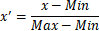
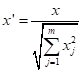
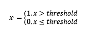
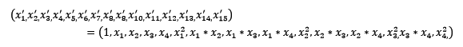
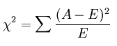
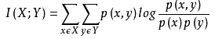

## 特征工程

参考链接：https://www.zhihu.com/question/29316149

https://feisky.xyz/machine-learning/appendix/rules-of-ml.html

1. 定义
2. 主要包含内容
3. 数据预处理
4. 特征选择

### 1. 定义

最大限度地从原始数据中提取特征以供算法和模型使用。 从原始数据转换为特征向量的过程。

### 2. 主要包含内容

2.1 数据预处理

2.2 特征选择

2.3 降维

2.4 模型使用

### 3. 数据预处理

1. 无纲量化
2. 定量特征二值化
3. 对定性特征哑编码
4. 数据变换
5. 缺失值填充
6. 移除重复样本、不良标签、不良特征值

#### 3.1 无纲量化

即特征的规格不一样，不能够放在一起比较。 **无量纲化使不同规格的数据转换到同一规格。** 

常见方法：

1. 标准化
2. 区间缩放法

##### 3.1.1 标准化

标准化的前提是特征值服从正态分布，标准化后，其转换成标准正态分布。

标准化需要计算特征的均值$$\overline{x}$$和标准差$$s$$，之后 将数据转化为标准正态分布：

$${x}'=\frac{x-\overline{x}}{s}$$

##### 3.1.2 区间缩放法

区间缩放法利用了边界值信息，将特征的取值区间缩放到某个特定的范围，例如[0, 1]等。 

区间缩放法的思路有多种，常见的一种为利用两个最值进行缩放，公式表达为： 

 

##### 3.1.3 标准化与归一化的区别

标准化是依照特征矩阵的列处理数据，其通过求z-score的方法，将样本的特征值转换到同一量纲下。归一化是依照特征矩阵的行处理数据，其目的在于样本向量在点乘运算或其他核函数计算相似性时，拥有统一的标准，也就是说都转化为“单位向量”。L2的归一化公式如下：

 

#### 3.2 对定量特征二值化

对于某些定量特征，其包含的有效信息为区间划分，例如学习成绩，假若只关心“及格”或不“及格”，那么需要将定量的考分，转换成“1”和“0”表示及格和未及格。二值化可以解决这一问题。 

 设定一个阈值，大于阈值的赋值为1，小于等于阈值的赋值为0，公式表达如下： 

#### 3.3 对定性特征哑编码（类似于one-hot）

某些机器学习算法和模型只能接受定量特征的输入，那么需要将定性特征转换为定量特征。最简单的方式是为每一种定性值指定一个定量值，但是这种方式过于灵活，增加了调参的工作。 

[通常使用哑编码的方式将定性特征转换为定量特征](https://link.zhihu.com/?target=http%3A//www.ats.ucla.edu/stat/mult_pkg/faq/general/dummy.htm)：**假设有N种定性值，则将这一个特征扩展为N种特征，当原始特征值为第i种定性值时，第i个扩展特征赋值为1，其他扩展特征赋值为0。**哑编码的方式相比直接指定的方式，不用增加调参的工作，对于线性模型来说，使用哑编码后的特征可达到非线性的效果。

 #### 3.4 数据变换（特征组合）

常见的数据变换有基于多项式的、基于指数函数的、基于对数函数的。4个特征，度为2的多项式转换公式如下： 

 

### 4. 特征选择

当数据预处理完成后，我们需要选择有意义的特征输入机器学习的算法和模型进行训练。

> 参见特征选择文档，有专门这方面的介绍

1. Filter 过滤法
2. Wrapper 包装法
3. Embedded 集成法

####  4.1 Filter 过滤法

按照发散性或者相关性对各个特征进行评分，设定阈值或者待选择阈值的个数，选择特征。 

##### 4.1.1 方差选择法

 使用方差选择法，先要计算各个特征的方差，然后根据阈值，选择方差大于阈值的特征。 

##### 4.1.2 相关系数法

使用相关系数法，先要计算各个特征对目标值的相关系数以及相关系数的P值。 

##### 4.1.3 卡方检验

 经典的卡方检验是检验定性自变量对定性因变量的相关性。假设自变量有N种取值，因变量有M种取值，考虑自变量等于$$i$$且因变量等于$$j$$的样本频数的观察值与期望的差距，构建统计量： 

不难发现，[这个统计量的含义简而言之就是自变量对因变量的相关性](https://link.zhihu.com/?target=http%3A//wiki.mbalib.com/wiki/%25E5%258D%25A1%25E6%2596%25B9%25E6%25A3%2580%25E9%25AA%258C)。 

#####  4.1.4 互信息法

互信息也是评价定性自变量对定性因变量的相关性的，互信息计算公式如下： 

#### 4.2 Wrapper 包装法

**递归特征消除法：**

递归消除特征法使用一个基模型来进行多轮训练，每轮训练后，消除若干权值系数的特征，再基于新的特征集进行下一轮训练。 

####  4.3 Embedded 集成法

##### 4.3.1 基于惩罚项的特征选择法

使用带惩罚项的基模型，除了筛选出特征外，同时也进行了降维。 实际上，[L1惩罚项降维的原理在于保留多个对目标值具有同等相关性的特征中的一个](http://www.zhihu.com/question/28641663/answer/41653367)，但，没选到的特征不代表不重要。所以，可结合L2惩罚项来优化。具体操作为：若一个特征在L1中的权值为1，选择在L2中权值差别不大且在L1中权值为0的特征构成同类集合，将这一集合中的特征平分L1中的权值

#####  4.3.2 基于树模型的特征选择法

树模型中GBDT也可用来作为基模型进行特征选择。

 ### 5. 降维

 高维情形下经常会碰到数据样本稀疏、距离计算困难的问题（称为 “维数灾难”），解决方法就是降维。

常用的降维方法有

- 主成分分析法（PCA）
- 核化线性降维（KPCA）
- 主成分回归（PCR）
- 偏最小二乘回归（PLSR）
- 萨蒙映射
- 多维尺度分析法（MDS）
- 投影寻踪法（PP）
- 线性判别分析法（LDA）
- 混合判别分析法（MDA）
- 二次判别分析法（QDA）
- 灵活判别分析法（Flexible Discriminant Analysis，FDA

 

 