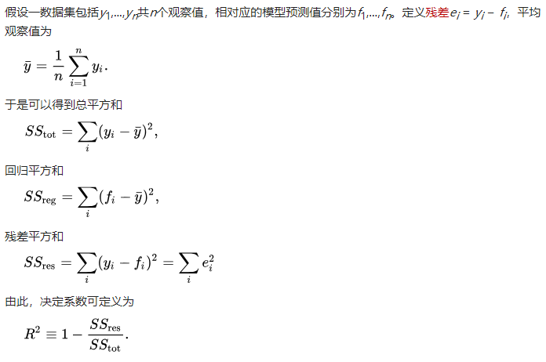
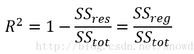
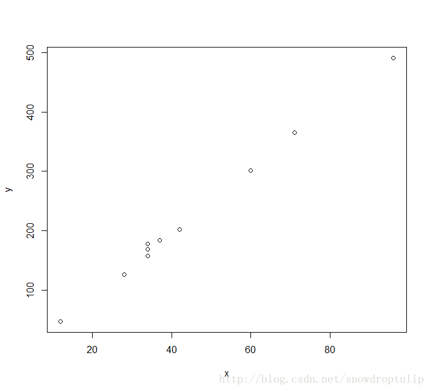
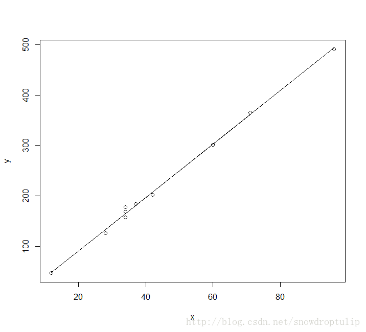
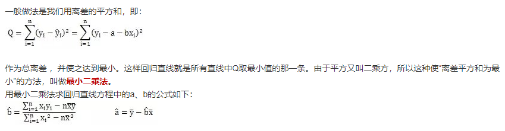

## 线性回归

1. 决定系数R2
2. 最小二乘计算出来的回归方程

### 1. 决定系数R2

决定系数为样本[相关系数](https://zh.wikipedia.org/wiki/%E7%9B%B8%E5%85%B3%E7%B3%BB%E6%95%B0)的平方。[[4\]](https://zh.wikipedia.org/wiki/%E5%86%B3%E5%AE%9A%E7%B3%BB%E6%95%B0#cite_note-Devore-4)当加入其他回归自变量后，决定系数相应地变为多重相关系数的平方。 

R2的通俗解释，是说明了自变量对因变量的解释程度，R2高，则说明了自变量解释了大部分的因变量的数字特征。当然，首先要排除了共线和伪回归的情况下。 





举例：

假设有10个点，如下图： 



代码：

```python
import matplotlib.pyplot as plt


def liner_func():
    x_list = [60, 34, 12, 34, 71, 28, 96, 34, 42, 37]
    y_list = [301, 169, 47, 178, 365, 126, 491, 157, 202, 184]
    length = len(x_list)
    x_mean = sum(x_list) / len(x_list)
    y_mean = sum(y_list) / len(y_list)
    xy_mean = sum([x_con * y_con for x_con in x_list for y_con in y_list]) / len(x_list)
    xx_mean = sum([x_con ** 2 for x_con in x_list]) / len(x_list)
    yy_mean = sum([y_con ** 2 for y_con in y_list]) / len(x_list)

    xy = 0
    x_square = 0
    for i in range(len(x_list)):
        xy += x_list[i] * y_list[i]
        x_square += x_list[i] ** 2
	
    # 下面有最小二乘法求出来的回归方程的公式，在第二个标题里面
    m = (xy - length * x_mean * y_mean) / (x_square - length * (x_mean ** 2))
    b = y_mean - m * x_mean

    # 线性回归方程
    def func(x):
        f = m * x + b
        return f

    plt.scatter(x_list, y_list)
    x_ = list(range(10, 100, 1))
    y_ = [func(con) for con in x_]
    # plt.plot(x_, y_)
    # plt.show()

    # 计算R2
    # 总平方和
    sst = sum([(y_con - y_mean) ** 2 for y_con in y_list])
    # 回归平方和
    ssreg = sum([(func(x_con) - y_mean) ** 2 for x_con in x_list])
    # 残差平方和
    ssres = sum([(func(x_list[i]) - y_list[i]) ** 2 for i in range(length)])

    R2 = 1 - (ssres / sst)
    res = ssreg / sst
    print(R2, res)

```

最后方程为：f(x)=5.3x-15.5

R2为99.8，说明x对y的解释程度非常高。



### 2. 最小二乘计算出来的回归方程




