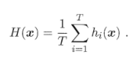
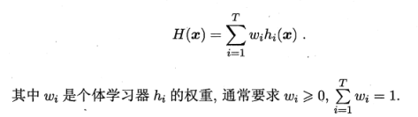
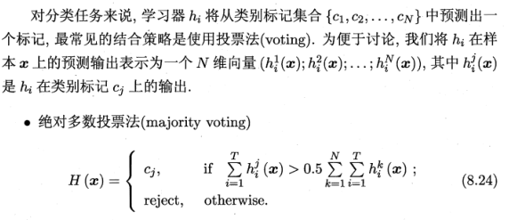
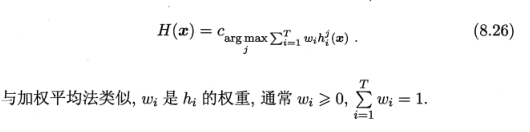
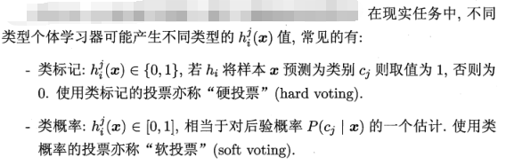
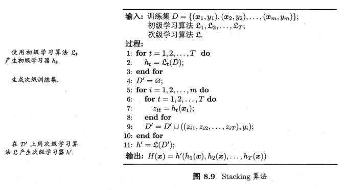

## 集成学习

1. AdaBoost
2. Bagging
3. 随机森林
4. 随机森林与Bagging比较
5. 组合策略

### 1. AdaBoost

**定义：**

AdaBoost，是英文“Adaptive Boosting"（自适应增强）的缩写，体现在前一个分类器分错的样本会被用来训练下一个分类器（即将错误样本的前面的权重加大）。AdaBoost方法对于噪声数据和异常数据很敏感。但相对于其他的分类器，不会容易出现过拟合现象。

步骤：

1. 设训练数据集$$T={(x1,y1), (x2, y2),..., (xN, yN)}$$ ，初始化训练数据的权值分布：

   $${D_1} = ({w_{11}},{w_{12}},...,{w_{1t}},...,{w_{1N}})$$，$${w_{1i}} = \frac{1}{N},i = 1,...,N$$

   **对于$$m=1,2,...,M$$** 

2. 使用具有权值分布$$D_m$$的训练数据集学习，得到基本分类器

   $${G_m}(x):\chi  \to \{  - 1, + 1\} $$

3. 计算$$G_m(x)$$在训练数据集上的分类误差率：

   $${e_m} = P({G_m}({x_i}) \ne {y_i}) = \sum\limits_{i = 1}^N {{w_{mi}}I({G_m}({x_i}) \ne {y_i})} $$

4. 计算$$G_m(x)$$分类器的系数：

   $${\alpha _m} = \frac{1}{2}\log \frac{{1 - {e_m}}}{{{e_m}}}$$

5. 更新数据集的权值分布

   $${D_{m + 1}} = ({w_{m + 1,1}},{w_{m + 1,2}},...,{w_{m + 1,i}},...,{w_{m + 1,N}})$$

   $${w_{m + 1,i}} = \frac{{{w_{mi}}}}{{{Z_m}}}\exp ( - {\alpha _m}{y_i}{G_m}({x_i}))$$，$$i = 1,...,N$$

   其中，$${{Z_m}}$$是规范化因子，用来进行归一化：

   $${Z_m} = \sum\limits_{i = 1}^N {{w_{mi}}\exp ( - {\alpha _m}{y_i}{G_m}({x_i}))} $$

   （其实和softmax差不多，目的是使$${D_{m + 1}}$$成为一个概率分布。）

6. 基于2-5步循化迭代，得到基本分类器的线性组合：

   $$f(x) = \sum\limits_{m = 1}^M {{\alpha _m}{G_m}(x)} $$

7. 得到最终的分类器：

   $$G(x) = sign(f(x)) = sign(\sum\limits_{m = 1}^M {{\alpha _m}{G_m}(x)} )$$

### 2. Bagging

Bagging是并行式集成学习方法最著名的代表。

基本流程：

1. 给定包含m个样本的数据集，随机取出一个样本放入采样集中，再把该样本放回初始数据集。
2. 经过m次步骤1的操作，得到一个包含m个样本的采样集。
3. 利用步骤1,2,得到T个包含m个样本的采样集，然后基于每个采样集训练一个基学习器。
4. 对这T个基学习器进行结合，得到最终结果。

结合方式：

1. 对于分类任务，使用投票法。

   即共T个学习器，预测出来T个结果，对于二分类，这T个结果，哪个结果所占的比例多，最终结果就为哪一类；

   如果两个类收到同样的票数，（T为偶数时），那么就随机的选择一个，或者考察学习器得出结果的置信度来确定最终胜利者。

2. 对于回归任务，使用简单平均法。

### 3. 随机森林

随机森林（Random Forest, RF）是Bagging的一个扩展变体。

基本流程:

1. 给定包含m个样本的数据集，随机取出一个样本放入采样集中，再把该样本放回初始数据集。经过m次步骤1的操作，得到一个包含m个样本的采样集。
2. 从所有属性中，随机选择k个属性，利用这k个属性划分决策树（k一般为logN, 假设原来有N个属性）
3. 重复步骤1、2，直到得到T个决策树
4. 将这T个决策树，进行组合，得到最终的结果。

重点：

两次随机：1. Booststrap，有放回的随机抽样。2. 每次随机的选择k个属性

### 4. 随机森林与Bagging比较

1. 如果以基分类器个数为x轴表示的话，随机森林起始性能较差，特别是只包含一个基学习器的时候，（因为随机森林里面的属性也是随机选出来k个并不包含所有的属性，所以肯定不如Bagging）
2. 随着基学习器个数的增多，随机森林往往比Bagging能获得更好的性能。
3. 随机森林的训练效率常优于Bagging。（因为在个体决策树的构建过程中，随机森林使用的是部分属性，决策肯定比拥有全体属性的Bagging要快。）

### 5. 组合策略

#### 5.1平均法：

* 简单平均法：

* 加权平均法：

**一般而言，在个体学习器性能相差较大时宜选用加权平均法，在个体学习器性能相近的时候宜采用简单平均法。**原因：加权平均的权重一般都是从训练数据中学习而得，现实任务中，训练样本通常不充分或存在噪声，这将使得学习出的权重不完全可靠，尤其是对规模比较大的集成来说，学习的权重比较多，较容易导致过拟合，所以**加权平均法未必一定优于简单平均法。** 

#### 5.2 投票法

1. 绝对多数投票法： 若某标记得票数过半数，则预测为该标记，否则拒绝预测。（这种拒绝预测的策略在可靠性要求较高的学习任务中最常使用，但是如果要求必须给一个结果，那么可以使用相对多数投票，使得每次预测都有结果）

   

2. 相对多数投票法：预测为得票最多的标记，若同时多个标记获得最高票数，那么随机的选取一个。

3. 加权投票法：

   

使用**类标记**和**类概率**问题：

1. 若基学习器类型一样，可以使用类概率，能获得更好的分类性能。（即，对一些能在预测出类别标记的同时产生分类置信度的学习器，其分类置信度可转化为类概率使用。若此类值未进行规范化，例如支持向量机的分类间隔值，则必须使用一些技术“Platt缩放”，“等分回归”等，进行“校准”,才能作为类概率使用。
2. 若基学习器的类型不同，往往通过将类概率输出转化为类标记，再进行投票。

#### 5.3 学习法

当训练数据很多时，一种更为强大的结合策略是使用“学习法”,即通过另一个学习器来进行结合。

把个体学习器称为初级学习器，用于结合的学习器称为次级学习器或元学习器。

下面介绍Stacking学习法：

一般使用初级学习器未使用的样本来产生次级学习器的训练样本。以k折交叉验证为例。

1. 初始训练集D被随机划分为k个大小相似的集合$$D_1,D_2,...,D_k$$,令$${D_j}$$和$${{\bar D}_j} = D\backslash {D_j}$$分别表示第j折的测试集和训练集。
2. 给定T个初级学习算法，初级学习器$$h_t^{(j)}$$表示在$${{\bar D}_j}$$上使用第t个学习算法而得。
3. 对$${D_j}$$中每个样本$$x_i$$，令$${z_{it}} = h_t^{(j)}({x_i})$$，则样本$$x_i$$由T个初级学习器得到结果$${z_i} = ({z_{i1}};{z_{i2}};...;{z_{iT}})$$，以此结果做为次级训练样例的示例部分，标记部分为$$y_i$$.
4. 于是，在整个交叉验证过程结束后，从这T个初级学习器产生的次级训练集是$$D' = \{ ({z_i},{y_i})\} _{i = 1}^m$$，然后$${D'}$$将用于训练次级学习器。

图示算法流程：

**Notice:**

  次级学习器的输入属性表示和次级学习算法对Stacking集成的泛化性能有很大影响，有研究表明，将初级学习器的输出类概率作为次级学习器的输入属性，用多响应线性回归作为次级学习算法效果较好。