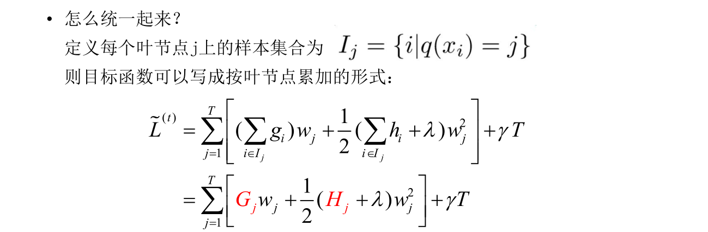

## 集成学习

参考链接：https://www.zhihu.com/question/26760839、

````
 https://mp.weixin.qq.com/s?__biz=MzI2NjkyNDQ3Mw==&mid=2247487512&idx=1&sn=df4fbcbec149832cae087487c14f8e74&chksm=ea87e8ceddf061d8ff05637c17a32610f8aeac1b7e665bd5edc283a59687970c7414e1b0829e&mpshare=1&scene=1&srcid=0901CSdKvWXdJTPQNCqeWMpp#rd
````

http://www.cnblogs.com/willnote/p/6801496.html

集成学习的个体学习器应“好而不同”，即个体学习器既要有一定的**准确性**，学习器之间也要具有**差异**。

根据个体学习器的生成方式，集成学习方法大致分为两类：

（1）个体学习器间存在强依赖关系、必须串行生成的序列化方法；eg: Boosting

（2）个体学习器间不存在强依赖关系，可以同时生成的并行化方法, eg: Bagging 和“随机森林”

1. AdaBoost
2. Bagging
3. 随机森林
4. 随机森林与Bagging比较
5. 组合策略
6. 偏差-方差解释

### 1. AdaBoost

AdaBoost是Boosting族最著名的代表。

**定义：**

AdaBoost，是英文“Adaptive Boosting"（自适应增强）的缩写，体现在前一个分类器分错的样本会被用来训练下一个分类器（即将错误样本的前面的权重加大）。AdaBoost方法对于噪声数据和异常数据很敏感。但相对于其他的分类器，不会容易出现过拟合现象。

步骤：(N个训练样本，训练M个学习器)

1. 设训练数据集$$T={(x1,y1), (x2, y2),..., (xN, yN)}$$ ，初始化训练数据的权值分布：

   $${D_1} = ({w_{11}},{w_{12}},...,{w_{1t}},...,{w_{1N}})$$，$${w_{1i}} = \frac{1}{N},i = 1,...,N$$

   **对于$$m=1,2,...,N$$** 

2. 使用具有权值分布$$D_m$$的训练数据集学习，得到基本分类器

   $${G_m}(x):\chi  \to \{  - 1, + 1\} $$

3. 计算$$G_m(x)$$在训练数据集上的分类误差率：

   $${e_m} = P({G_m}({x_i}) \ne {y_i}) = \sum\limits_{i = 1}^N {{w_{mi}}I({G_m}({x_i}) \ne {y_i})} $$

   其中，$$I({G_m}({x_i}) \ne {y_i})$$如果括号中的等式不相等，那么计数为1，否则为0

   $$if$$  $$ e_m >0.5, then Break$$  停止学习器的学习。

4. 计算$$G_m(x)$$分类器的系数：

   $${\alpha _m} = \frac{1}{2}\log \frac{{1 - {e_m}}}{{{e_m}}}$$

5. 更新数据集的权值分布

   $${D_{m + 1}} = ({w_{m + 1,1}},{w_{m + 1,2}},...,{w_{m + 1,i}},...,{w_{m + 1,N}})$$

   $${w_{m + 1,i}} = \frac{{{w_{mi}}}}{{{Z_m}}}\exp ( - {\alpha _m}{y_i}{G_m}({x_i}))$$，$$i = 1,...,N$$

   其中，$${{Z_m}}$$是规范化因子，用来进行归一化：

   $${Z_m} = \sum\limits_{i = 1}^N {{w_{mi}}\exp ( - {\alpha _m}{y_i}{G_m}({x_i}))} $$

   （其实和softmax差不多，目的是使$${D_{m + 1}}$$成为一个概率分布。）

6. 基于2-5步循化迭代，得到基本分类器的线性组合：

   $$f(x) = \sum\limits_{m = 1}^M {{\alpha _m}{G_m}(x)} $$

7. 得到最终的分类器：

   $$G(x) = sign(f(x)) = sign(\sum\limits_{m = 1}^M {{\alpha _m}{G_m}(x)} )$$

注意：

在第三步中有一个判断条件，即在每一轮的迭代过程中，都要检查基分类器是否比随机猜想好，一旦条件不满足，则当前基学习器即被抛弃，且学习过程停止。

在此情况下，提前停止，可能导致最终的学习器里面只包含了少数的基学习器，性能不佳。若采用**“重采样法”**，即抛弃当前的不满足条件的基学习器后，根据当前分布重新对训练样本进行采样，再用基于新的采样结果训练出基学习器，从而使迭代可以继续进行下去。


### 2. Bagging

Bagging是并行式集成学习方法最著名的代表。

基本流程：

1. 给定包含m个样本的数据集，随机取出一个样本放入采样集中，再把该样本放回初始数据集。
2. 经过m次步骤1的操作(称为自助采样法)，得到一个包含m个样本的采样集。
3. 利用步骤1,2,得到T个包含m个样本的采样集，然后基于每个采样集训练一个基学习器。
4. 对这T个基学习器进行结合，得到最终结果。

结合方式：

1. 对于分类任务，使用投票法。

   即共T个学习器，预测出来T个结果，对于二分类，这T个结果，哪个结果所占的比例多，最终结果就为哪一类；

   如果两个类收到同样的票数，（T为偶数时），那么就随机的选择一个，或者考察学习器得出结果的置信度来确定最终胜利者。

2. 对于回归任务，使用简单平均法。

还有一个优点：由于使用“自助采样法”, 新采样出来的m个样本，只占初始训练集中约63.2%的样本，剩下的约36.8%的样本可以用作验证集来对泛化性能进行“包外估计”，当然也就需要在采样的时候记录哪些样本被采样出来了。另外，当基学习器是决策树的时候，“包外估计”还可以用来辅助剪枝。当基学习器是神经网络时，可以使用包外样本来辅助早期停止，以减小过拟合风险。

### 2a 为什么说Bagging减少variance, boosting减少bias

**对于Bagging：**

Bagging对样本重新采样，由于新采样的样本集的相似性，以及使用的是同种模型，因此各模型有近似相等的bias和variance,（事实上各模型的分布也近似相同，但不独立），由于$$E[\frac{1}{n}\sum {{X_i}] = E[{X_i}]} $$ ,所以Bagging后的bias和子模型（单个学习器）的bias接近，一般来说不能显著降低bias，另一方面：

若各个子模型独立，则有：

$$V(\frac{1}{n}\sum {{X_i}} ) = \frac{1}{n}Var({X_i})$$，此时可以显著降低variance，

若各个子模型完全相同，则

$$V(\frac{1}{n}\sum {{X_i}} ) = Var({X_i})$$， 此时不会降低variance，

Bagging方法得到的各个子模型是有一定相关性的，属于上面两个极端状态的中间态，所以可以一定程度的减少variance，为了进一步降低variance，随机森林通过随机的选取属性，构造属性子集，来降低各模型之间的相关性，使得variance进一步降低。

**对于boosting：**

boosting是采用贪心法来最小化损失函数：$$L(y,\sum\limits_i {{\alpha _i}{G_i}(x)} )$$ ，因此boosting在序列化地最小化损失函数，其bias自然逐步下降，但是采用这种方式，各子模型之间是强相关的，所以子模型的线性组合并不能显著降低variance，所以boosting主要依靠降低bias来提升预测精度。

### 3. 随机森林

随机森林（Random Forest, RF）是Bagging的一个扩展变体。

基本流程:

1. 给定包含m个样本的数据集，随机取出一个样本放入采样集中，再把该样本放回初始数据集。经过m次步骤1的操作，得到一个包含m个样本的采样集。
2. 从所有属性中，随机选择k个属性，利用这k个属性划分决策树（k一般为logN, 假设原来有N个属性）
3. 重复步骤1、2，直到得到T个决策树
4. 将这T个决策树，进行组合，得到最终的结果。

重点：

两次随机：1. Booststrap，有放回的随机抽样。2. 每次随机的选择k个属性

### 4. 随机森林与Bagging比较

1. 如果以基分类器个数为x轴表示的话，随机森林起始性能较差，特别是只包含一个基学习器的时候，（因为随机森林里面的属性也是随机选出来k个并不包含所有的属性，所以肯定不如Bagging）

   

2. 随着基学习器个数的增多，随机森林往往比Bagging能获得更好的性能。

3. 随机森林的训练效率常优于Bagging。（因为在个体决策树的构建过程中，随机森林使用的是部分属性，决策肯定比拥有全体属性的Bagging要快。）

### 5. 组合策略

#### 5.1平均法：

* 简单平均法：


* 加权平均法：


**一般而言，在个体学习器性能相差较大时宜选用加权平均法，在个体学习器性能相近的时候宜采用简单平均法。**原因：加权平均的权重一般都是从训练数据中学习而得，现实任务中，训练样本通常不充分或存在噪声，这将使得学习出的权重不完全可靠，尤其是对规模比较大的集成来说，学习的权重比较多，较容易导致过拟合，所以**加权平均法未必一定优于简单平均法。** 

#### 5.2 投票法

1. 绝对多数投票法： 若某标记得票数过半数，则预测为该标记，否则拒绝预测。（这种拒绝预测的策略在可靠性要求较高的学习任务中最常使用，但是如果要求必须给一个结果，那么可以使用相对多数投票，使得每次预测都有结果）

   

2. 相对多数投票法：预测为得票最多的标记，若同时多个标记获得最高票数，那么随机的选取一个。

3. 加权投票法：

   

使用**类标记**和**类概率**问题：


1. 若基学习器类型一样，可以使用类概率，能获得更好的分类性能。（即，对一些能在预测出类别标记的同时产生分类置信度的学习器，其分类置信度可转化为类概率使用。若此类值未进行规范化，例如支持向量机的分类间隔值，则必须使用一些技术“Platt缩放”，“等分回归”等，进行“校准”,才能作为类概率使用。
2. 若基学习器的类型不同，往往通过将类概率输出转化为类标记，再进行投票。

#### 5.3 学习法

当训练数据很多时，一种更为强大的结合策略是使用“学习法”,即通过另一个学习器来进行结合。

把个体学习器称为初级学习器，用于结合的学习器称为次级学习器或元学习器。

下面介绍Stacking学习法：

一般使用初级学习器未使用的样本来产生次级学习器的训练样本。以k折交叉验证为例。

1. 初始训练集D被随机划分为k个大小相似的集合$$D_1,D_2,...,D_k$$,令$${D_j}$$和$${{\bar D}_j} = D\backslash {D_j}$$分别表示第j折的测试集和训练集。
2. 给定T个初级学习算法，初级学习器$$h_t^{(j)}$$表示在$${{\bar D}_j}$$上使用第t个学习算法而得。
3. 对$${D_j}$$中每个样本$$x_i$$，令$${z_{it}} = h_t^{(j)}({x_i})$$，则样本$$x_i$$由T个初级学习器得到结果$${z_i} = ({z_{i1}};{z_{i2}};...;{z_{iT}})$$，以此结果做为次级训练样例的示例部分，标记部分为$$y_i$$.
4. 于是，在整个交叉验证过程结束后，从这T个初级学习器产生的次级训练集是$$D' = \{ ({z_i},{y_i})\} _{i = 1}^m$$，然后$${D'}$$将用于训练次级学习器。

图示算法流程：


**Notice:**

  次级学习器的输入属性表示和次级学习算法对Stacking集成的泛化性能有很大影响，有研究表明，将初级学习器的输出类概率作为次级学习器的输入属性，用多响应线性回归作为次级学习算法效果较好。

### 6. 偏差-方差解释

假设永远都无法你和出真实分布，**偏差表达预测值与真实值的偏离程度**，如果预测值完美的等于真实值，那么偏差为零，但学习器很可能是过拟合的。**方差表达同一学习器在不同数据上预测值的离散程度**，如果预测值均一致，那么方差为零，但是学习器很可能是欠拟合的。

### 7. 指数损失

样本重要程度相同的情形下，指数损失为 ：$$\frac{1}{n}\sum\nolimits_i {\exp ( - {y_i}f({x_i}))}  $$ 

$$y_i$$表示真实的类别标记，$$f(x_i)$$表示预测类别标记，总的损失可以理解为：对每个样本进行预测之后的取指数损失的平均值。

### 8. GBDT （梯度提升决策树）

在《非参数模型进阶》中详细介绍了回归树，最初的梯度集成办法正是回归树的叠加。

*  简介

GBDT(Gradient Boosting Decision Tree),梯度提升树，提升的方法依然采用的是加法模型与前向分布算法。以决策树为基函数的提升办法称为提升树，对分类问题决策树是二叉分类树，对回归问题决策树是二叉决策树。

* 与Adboost的区别

GBDT与Adboost最主要的区别在于两者如何识别模型的问题。Adaboost用错分数据点来识别问题，通过调整错分数据点的权重来改进模型。GBDT通过负梯度来识别问题，通过计算负梯度来改进模型。 

* 多分类问题

在多分类问题中，假设有k个类别，那么每一轮迭代实质是构建了k棵树，对某个样本x的预测值为 

$$f_{1}(x),f_{2}(x),...,f_{k}(x) $$

之后使用softmax可以得到属于每一个类别的概率，此时该样本的loss即可以用logitloss来表示，并对所有类别的f(x)都可以算出一个梯度，即可以计算出当前轮的残差，供下一轮迭代学习。 

> 不知道放在哪：一般分类为提升树和梯度提升树，提升树是在每一步去拟合上一步的残差，而梯度提升树是用负梯度近似残差。但这样的看法会让人误以为残差比起负梯度是更根本性的东西，但事实上残差和负梯度本来就是一回事情，负梯度具有更普遍的意义。而且最重要的是，在更一般的情况下，我们理论上需要拟合的也不是负梯度。 

* 学习过程

##### 8.1 版本1：

采样前向分布算法：

$$f_{0}(x)=0\\ f_{m}(x)=f_{m-1}(x)+T(x;\Theta), m=1,2,...,M\\ f_{M}(x)=\sum_{m=1}^{M}T(x;\Theta_{m}) $$

其中：$$f_{0}(x)=0$$  为初始提升树，之后第m步的模型即为第二个式子，其中$$T(x;Θ)$$表示决策树，$$Θ$$为决策树的参数； 第三个式子表示GBDT的最终模型，其中M为树的个数。 

在前向分布算法的第m步， 给定当前模型$$f_{m-1}(x) $$，需求解：

$$\hat{\Theta}_{m}=\underset{\Theta_{m}}{arg\ min}\sum_{i=1}^{N}L(y_{i},f_{m-1}(x_{i})+T(x_{i};\Theta_{m}))$$

得到的$$Θ^m$$即为第m颗树的参数。当采用平方误差作为损失函数时：

$$L(y,f(x))=(y-f(x))^{2} $$

带入上式中，则其损失函数变为： 

$$L(y,f_{m-1}(x)+T(x;\Theta_{m}))\\  =[y-f_{m-1}(x)-T(x;\Theta_{m})]^{2}\\  =[r-T(x;\Theta_{m})]^{2}$$ 

其中，$$r=y-f_{m-1}(x) $$ ，是当前模型拟合数据的残差。所以，对于回归问题的提升树算法来说，只需简单地拟合当前模型的残差。即每一轮产生的残差作为下一轮回归树的输入，下一轮的回归树的目的就是尽可能的拟合这个输入残差。 

##### 8.2 版本2（更一般的推导）：

递推公式：

$${F_n}(x) = {F_{n - 1}} + {T_n}(x)$$

定义Boosting的损失函数为：

$$L(y,{F_n}(x)) = L(y,{F_{n - 1}} + {T_n}(x))$$

将$$F_{n-1}$$作为变量，对损失函数做泰勒展开，保留到二阶项：

$$L(y,{F_{n - 1}}) + \frac{{\partial L}}{{\partial {F_{n - 1}}}}{T_n} + \frac{{{\partial ^2}L}}{{2{\partial ^2}{F_{n - 1}}}}T_n^2$$

要使损失函数最小，就是最小化上面的泰勒展开，第一项为常数项，不参与优化，第二项的系数我们记为$$L'$$，第三项的系数我们记为$$L''$$，所以我们令后两项之和为零：

$${T_n} =  - \frac{{L'}}{{L''}}$$

当损失是均方误差时，$$L'$$是残差，$$L''$$为1，所以下一步的学习器需要拟合上一步的残差。对于更一般的损失函数，我们需要拟合一阶导数，和二阶导数，只是，二阶导数一般接近于1，所以我们选择负梯度作为下一步需要拟合的目标。

##### 8.3 GBDT比传统的boosting使用更少的树深度

GBDT每一轮训练时所关注的重点是本轮产生结果的残差，下一轮以本轮残差作为输入，尽量去拟合这个残差，使下一轮输出的残差不断变小。所以GBDT可以做到每一轮一定向损失函数减小的梯度方向变化，而传统的boosting算法只能是尽量向梯度方向减小，这是GBDT与传统boosting算法最大的区别，这也是为什么GBDT相比传统boosting算法可以用更少的树个数与深度达到更好的效果。

##### 8.4 与AdaBoost的比较

和AdaBoost一样，Gradient Boosting也是重复选择一个表现一般的模型并且每次基于先前模型的表现进行调整。不同的是，AdaBoost是通过提升错分数据点的权重来定位模型的不足，而GBDT是通过算梯度来定位模型的不足。因此相比AdaBoost，GBDT可以使用更多种类的目标函数。

##### 8.5 其他总结

- 回归问题
  1) 用回归树去拟合残差，其实就是用回归树去拟合目标方程关于f（x）的梯度。
  2) 回归的目标函数并不一定会用square loss。square loss的优点是便于理解和实现，缺点在于对于异常值它的鲁棒性较差，一个异常值造成的损失由于二次幂而被过分放大，会影响到最后得到模型在测试集上的表现。可以算则Absolute loss或者Huber loss代替。
- 分类问题
  1) 此时的目标函数常用log loss，如KL-散度或者交叉熵。
  2) 除了损失函数的区别外，分类问题和回归问题的区别还在于当多分类问题时，每轮可能会训练多个分类器。
- 由于决策树是非线性的，并且随着深度的加深，非线性越来越强，所以基于决策树的GBDT也是非线性的。

### 9. xgboost

##### 9.1 简介

 xgboost 的全称是eXtreme Gradient Boosting，由华盛顿大学的陈天奇博士提出，在Kaggle的希格斯子信号识别竞赛中使用，因其出众的效率与较高的预测准确度而引起了广泛的关注。 

##### 9.2 与Adboost的区别

GBDT算法只利用了一阶的导数信息，XGBoost对损失函数做了二阶的泰勒展开，并在目标函数之外加入了正则项对整体求最优解，用以权衡目标函数的下降和模型的复杂程度，避免过拟合。所以不考虑细节方面，两者最大的不同就是目标函数的定义，接下来就着重从XGBoost的目标函数定义上来进行介绍。 

##### 9.3 目标函数

相比于GBDT，XGBoost的目标函数多了正则项，使得学习出来的模型更加不容易过拟合。

有哪些可以衡量树的复杂度呢？

输的深度，内部节点个数，**叶子结点个数(T)**，**叶结点分数(w)**...

XGboost采用：

$$\Omega(f_{t})=\gamma T+\frac{1}{2}\lambda {\left\| w \right\|^2}$$

对叶子结点个数进行惩罚，相当于在训练中做了剪枝处理。

XGboost的**目标函数定义**如下： 

$$L^{(t)}=\sum_{i=1}^{n}l(y_{i},\hat{y}_{i}^{(t)})+\sum_{i=1}^{t}\Omega(f_{i})$$

将$$\hat{y}_{i}^{(t)}$$拆分后有

$$L^{(t)}_=\sum_{i=1}^{n}l(y_{i},\hat{y}_{i}^{(t-1)}+f_{t}(x_{i}))+\Omega(f_{t})+constant $$

其中，$$t$$表示第$$t$$轮，$$f_t$$表示第$$t$$轮所生成的树模型，$$Ω(f_i)$$表示正则项，$$constant=∑_{i=1}^{t−1}Ω(fi)$$。

使用泰勒展开式：

$$f(x+\bigtriangleup x)\simeq f(x)+f^{'}(x)\bigtriangleup x+ \frac{1}{2}f^{''}(x)\bigtriangleup x^{2}$$

则上式目标函数将其中第一项用泰勒后，整个式子变为:

$$L^{(t)}\simeq \sum_{i=1}^{n}[l(y_{i},\hat y_{i}^{(t-1)})+g_{i}f_{t}(x_{i})+\frac{1}{2}h_{i}f_{t}^{2}(x_{i})]+\Omega(f_{t})+constant$$

其中，$$g_{i}=\partial _{\hat y(t-1)}l(y_{i},\hat y^{t-1}),h_{i}=\partial _{\hat y(t-1)}^{2}l(y_{i},\hat y^{t-1})$$

因为$$l(yi, \hat{y}^{(t−1)}_i)$$的值由之前的过程决定，所以本轮不变，$$constant$$也不影响本轮的训练，所以将这两者其去掉，得到： 

$$\tilde L^{(t)}\simeq \sum_{i=1}^{n}[g_{i}f_{t}(x_{i})+\frac{1}{2}h_{i}f_{t}^{2}(x_{i})]+\Omega(f_{t}) $$

将树拆分成结构部$$q$$和叶子权重部分$$w$$ ，并把正则项$$\Omega(f_{t})$$，也写成树的形式：

$$f_{t}(x)=w_{q}(x) $$，$$\Omega(f_{t})=\gamma T+\frac{1}{2}\lambda {\left\| w \right\|^2}$$

代入目标函数中，


（手打版公式）：

$${{\tilde L}^{(t)}} = \sum\limits_{i = 1}^n {[{g_i}{f_t}({x_i}) + \frac{1}{2}{h_i}f_t^2({x_i})] + \Omega ({f_t})} \\= \sum\limits_{i = 1}^n {[{g_i}{w_{q({x_i})}} + } \frac{1}{2}{h_i}w_{q({x_i})}^2] + \gamma T + \lambda \frac{1}{2}\sum\limits_{j = 1}^T {w_j^2} $$

则对于上式有：




如果确定了树的结构（即q(x)确定），为了使目标最小，可以令其导数为0，解得每个叶子结点的最优预测分数为：

$$w_j^* =  - \frac{{{G_j}}}{{{H_j} + \lambda }}$$

代入目标函数，得到最小损失为：

$${{\tilde L}^*} =  - \frac{1}{2}\sum\limits_{j = 1}^T {\frac{{G_j^2}}{{{H_j} + \lambda }}}  + \gamma T$$

当回归树的结构确定时，我们前面已经推导出其最优的叶节点分数以及对应的最小损失值，问题是怎么确定树的结构？
暴力枚举所有可能的树结构，选择损失值最小的， - NP难问题
贪心法，每次尝试分裂一个叶节点，计算分裂前后的增益，选择增益最大的

**分裂前后的增益怎么计算？**
ID3算法采用信息增益
C4.5算法采用信息增益率
CART采用Gini指数
XGBoost呢？


